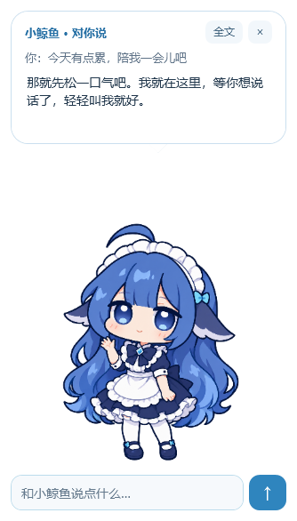

# DeepSeek Whale Desktop Pet · 小鲸鱼桌宠

运行在 Windows 桌面上的鲸鱼娘：查询 DeepSeek 账户余额、提醒扣费，并通过文字气泡陪你聊天。独立运行，无需 DSH。

> **AI 生成声明：**本项目的程序代码、文档和鲸鱼娘角色立绘主要由 AI 生成，并根据项目作者提出的需求迭代。角色形象的参考来源见下文“参考与素材说明”。

**[下载 Windows 版](https://github.com/ZoTtfoy/DeepSeek-Whale-Desktop-Pet/releases/latest)** · [使用说明](docs/使用说明.md)



## 功能

- 定时查询余额，头顶浮出扣费金额，支持低余额与预算预警、近七天观测记录。
- DeepSeek API 对话；输入在脚下，回复在头顶，支持逐字显示、滚动和复制。
- 站、坐、趴三种姿态；眨眼、呼吸、摸头、害羞和连击抗议。
- 新增可替换分层动态模型：鲸鱼娘的刘海、面部、眼睛、手臂和裙摆分别运动；右键可选择其他本地模型或切回经典立绘。
- 局部网格运动与平滑回正，减少整张图晃动的僵硬感。
- 40%–220% 自由缩放，独立字号，Windows 高 DPI 适配。
- 数据栏与输入栏可分别隐藏；安静陪伴、小睡唤醒、位置锁定与托盘菜单。
- 30／60／120 帧目标选择，实际帧率受屏幕和系统负载限制。

## 使用

1. 从 Releases 下载最新的 `DeepSeekWhale-v*-Windows.zip`，完整解压。
2. 双击 `DeepSeekWhale.exe`，在设置中填入自己的 DeepSeek API Key。
3. 右键角色打开菜单，滚轮调整大小，拖动移动；点头部可摸头。

适用于安装 .NET Framework 4.8 的 Windows 10/11。程序无需管理员权限。升级前从托盘退出旧版；不要同时运行多个版本。保留 `.exe.config`、`poses` 和 `models` 文件夹。

模型替换步骤与格式见 [可替换分层角色模型](docs/分层模型格式.md)。新模型是自有二维分层格式，不是 Live2D Cubism；Cubism 的 `.model3.json`／`.moc3` 目前不能直接加载。

为后续 Cubism 绑定准备的 13 图层 PSD，可用 `tools/export_cubism_psd.py` 从现有贴图导出；步骤见 [Cubism 编辑器素材交接](docs/Cubism编辑器交接.md)。PSD 是待绑定素材，不是已经完成的 Live2D 模型。

API 聊天会产生费用。扣费金额为两次成功查询之间的余额差额，不是逐笔账单。程序没有服务端中转；密钥仅用于 DeepSeek 官方 API，记住密钥时使用 Windows DPAPI 加密。设置位于当前用户的 `%LOCALAPPDATA%\DeepSeekWhaleStandalone\settings.json`。不要将自己的设置文件提交到仓库。

## 动画预览


GIF 展示的是经典立绘的局部网格动画。新分层模型支持独立部件运动；内置鲸鱼娘站姿使用它，坐姿和趴姿切回经典立绘。跨姿势仍使用短过渡，不包含完整起身／坐下中间帧，也不是 Cubism Live2D 模型。GIF 仅为 30 帧演示，运行时动作实时计算。

## 从源码构建

Windows PowerShell 或 PowerShell 7，在仓库目录执行：

```powershell
powershell -NoProfile -ExecutionPolicy Bypass -File .\build.ps1
```

使用 Windows 自带的 .NET Framework 编译器，不需要下载第三方构建依赖。生成程序、便携 ZIP 与 SHA-256 文件位于 `dist`。命令中的执行策略仅对当前构建进程生效。

```powershell
powershell -NoProfile -ExecutionPolicy Bypass -File .\test.ps1
```

测试使用模拟余额、离线窗口和离线图片渲染，不加载用户密钥、不调用 API。覆盖动作取样、网格接触和翻折、连击、休眠、扣费及不同缩放布局。未做真实付费聊天端到端测试。

## 参考与素材说明

功能参考 [VPet](https://github.com/LorisYounger/VPet) 与 [BongoCat](https://github.com/ayangweb/BongoCat) 的桌宠交互体验。项目起点参考 [DeepSeek-Balance-Whale-Widget](https://github.com/MeteorNOX/DeepSeek-Balance-Whale-Widget)。当前角色以该项目形象为参考生成重绘；生成说明保留在 `docs/art-notes`。

不将参考项目的代码许可证延伸到角色美术。角色素材权利不等同于程序源码许可；本仓库当前未另行指定开源许可证。公开源码不表示授予所有素材的商用或再分发许可。
